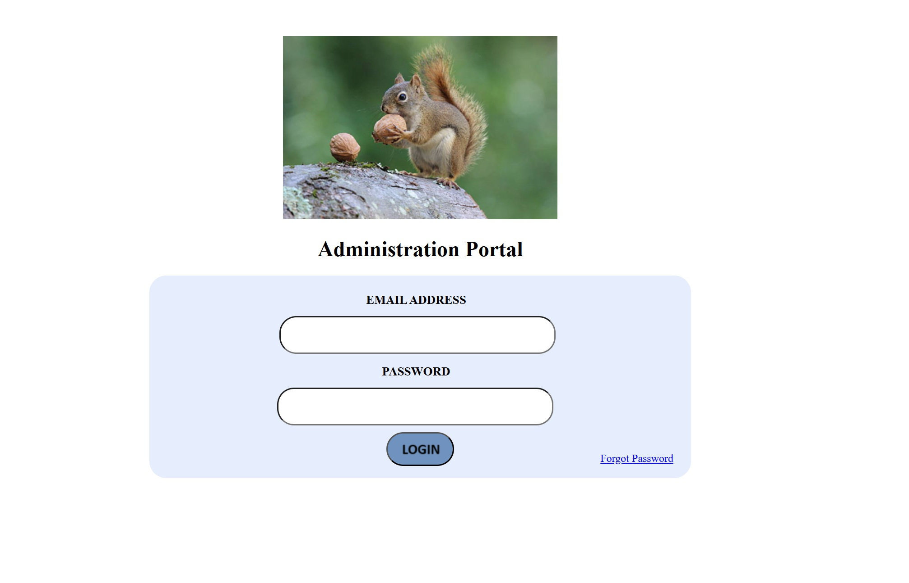

# Python Login and Dashboard test

*** WORK IN PROGRESS ***

  

Experiments with user login authentication using MD5 Hash encryption

Experiments with Dashboard app concept (under construction)

<b>TODO:</b>

<i>* JSON data layer (needs implementing) implemented for example use instead of DB connection</i>
<i>* Error checking of input fields for email and password</i>

